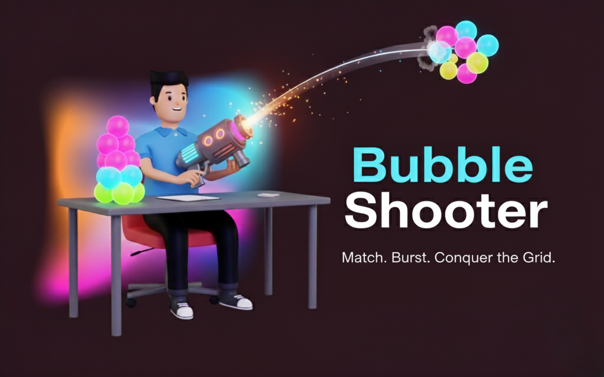
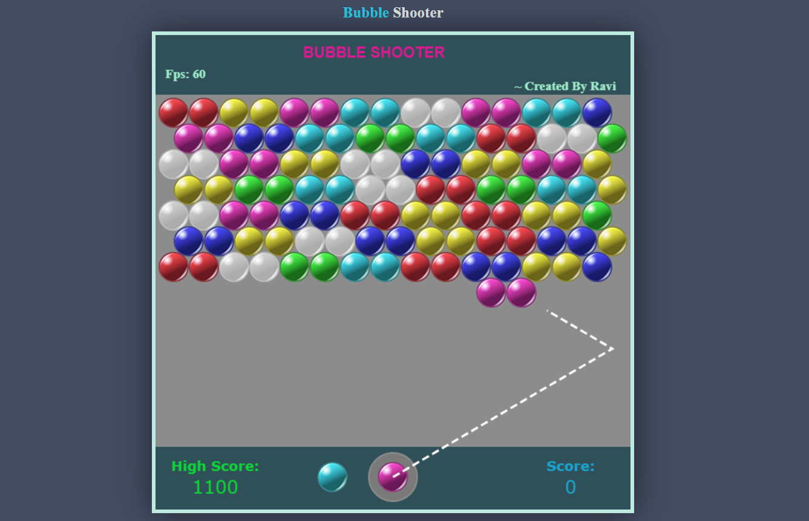

# Bubble Shooter 🫧


---
## 🚀 Overview
**Bubble Shooter** is an interactive, physics-based arcade game built using pure **HTML5 Canvas** and **JavaScript**. The goal is to shoot colored bubbles to form clusters of three or more, causing them to burst and drop.
 **Match. Burst. Conquer the Grid.**
 **🔗 Play it Live:** [Bubble Shooter Live Demo](https://ravi-kumar-chinta.github.io/bubble-shooter/)

---
## ✨ Key Features
✅ **Precise Aiming** – Includes a **Prediction Line** with bounce physics for accurate shots.
✅ **Dynamic Scoring** – Features a **Scoring Multiplier** for dropping large, detached clusters.
✅ **Game Awareness** – **"Next Up" Row Preview** shows the player when the next row will drop down.
✅ **High Score Tracking** – Saves your personal best score using browser's `localStorage`.
✅ **Classic Gameplay** – Core logic for cluster finding, removal, and floating bubble detection.
---
## 🛠️ Technologies Used
- **HTML5 Canvas** – Game viewport and rendering.
- **CSS3** – External styling for layout and custom title.
- **JavaScript (ES6+)** – All game logic, physics, and state management.
---
## ⚙️ Installation & Setup
1. **Clone the repository:**
```bash
git clone [https://github.com/ravikumar4217/bubble-shooter.git](https://github.com/ravikumar4217/Bubble-Shooter.git)
```
2. **Navigate to the project directory:**

```Bash
cd Bubble-Shooter
```
3. **Run:** 
Open `index.html` directly in your web browser

---
## 📂 File Structure
```Bash
.
├── assets/
│   ├── images/
│   │   ├── banner.png           # Banner image
│   │   ├── bubble-sprites.png   # Sprite sheet for bubbles
│   │   ├── favicon.png          # Browser icon
│   │   └── Screenshot.png       # Game screenshot
├── index.html                   # Main game entry point
├── script.js                    # Core JavaScript game logic
├── style.css                    # Styling for the overall layout
└── README.md                    # Project documentation
```
---
## 🎮 How to Play

- **Aim:** Move your mouse to change the angle of the launcher; the prediction line shows the path.
- **Shoot:** Click the left mouse button to launch the current bubble.
- **Goal:** Create a cluster of **three or more** matching colored bubbles upon impact to clear them.
- **Game Over:** The game ends if the bubbles reach the bottom edge of the screen.
---
## 🖼️ Game Preview
- **Here’s how the game looks:**



---

---
## ✅ Conclusion
- **Bubble Shooter** includes essential modern features like the **prediction line** and **high score saving**.
- Built using **HTML5 Canvas**, **CSS**, and **JavaScript** without reliance on heavy frameworks.
- Designed for an engaging and fast-paced arcade experience.
---
## 🎉 Enjoy the Game!
Get ready for some addictive bubble-popping action! 🚀